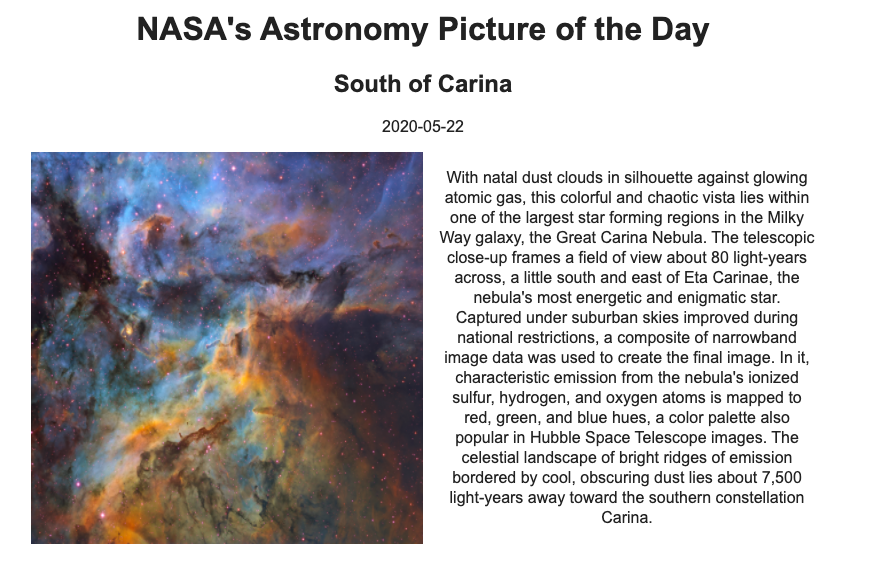

<h1 align="center">Pulling NASA Data with the Fetch API 🌍🌝 </h1>
<p>
  
  <a href="https://twitter.com/sophia_wyl">
    
  </a>
</p>

> NASA has a bunch of [cool (and entirely free & accessible) APIs](https://api.nasa.gov/) available for public use. This project walks us through how to use the Fetch API to get data from the NASA Astronomy Picture of the Day (APOD) API and display it on our browser.



Language: JavaScript

## Prerequisites

- [Free NASA API key](https://api.nasa.gov/)

## Install

1. Clone the repo

```sh
git clone https://github.com/sophi-li/fetch.git
```

2. Navigate into the repo

```sh
cd fetch
```

3. Add your API key

4. Open Live Server with VSCode.

## Tutorial

You can find a full tutorial on how to use the Fetch API in my [blog post](https://sophiali.dev/javascript-fetch-api-with-nasa-api).

## Author

👤 Sophia

- Twitter: [@sophia_wyl](https://twitter.com/sophia_wyl)
- GitHub: [@sophi-li](https://github.com/sophi-li)
